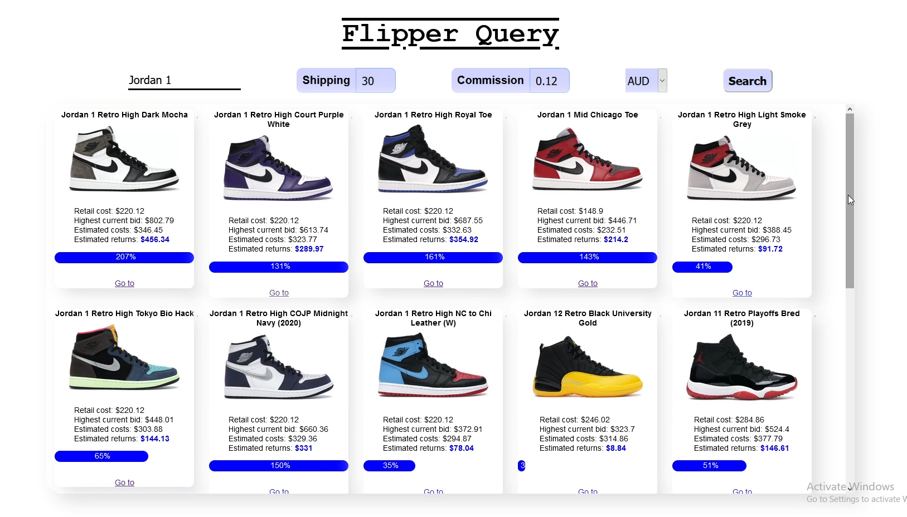

# Flipper-Query
Flipper-Query is a web application that allows the user to obtain StockX resale product information.

Please note that due to the blocking of the scraper by StockX the web application no longer works.

### To install everything
- npm i

### To run dev mode (refresh after each change)
- npm i nodemon
- npm run dev <u>or</u> nodemon index.js

### To compile into an executable
- npm install pkg
- <b>For all platforms:</b> pkg .
- <b>For 64bit windows:</b> pkg -t node12-win-x64 .
